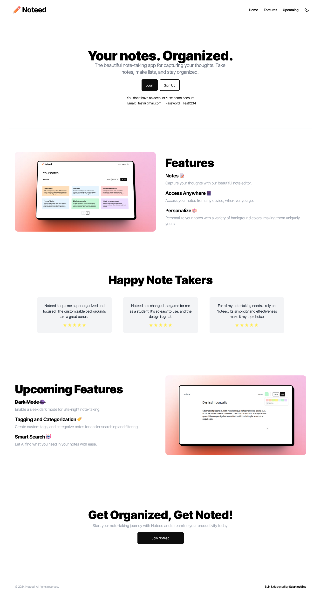

# Noteed

A versatile note-taking application that empowers users to effortlessly write and manage diverse content, while offering seamless access to their notes from various devices.

I've used Vercel for the deployment. Give it a try: https://noteed-lime.vercel.app/

## Tech Stack

- Front-end: React, React Query, React Router, Tailwind CSS (Daisy UI).
- Back-end: Xano to store notes, and generate RESTful APIs.
- Authentication: Auth0.

## Screenshot



## Run Locally

Clone the project

```bash
  git clone https://link-to-project
```

Go to the project directory

```bash
  cd my-project
```

Install dependencies

```bash
  npm install
```

Start the server

```bash
  npm start
```
