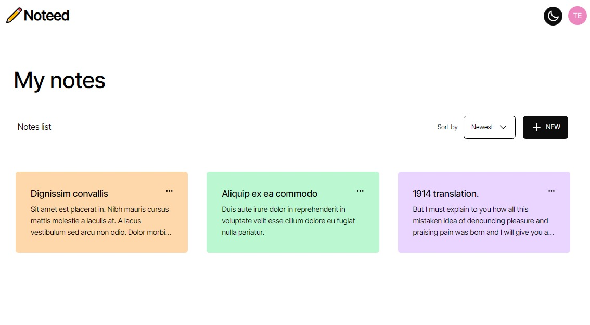
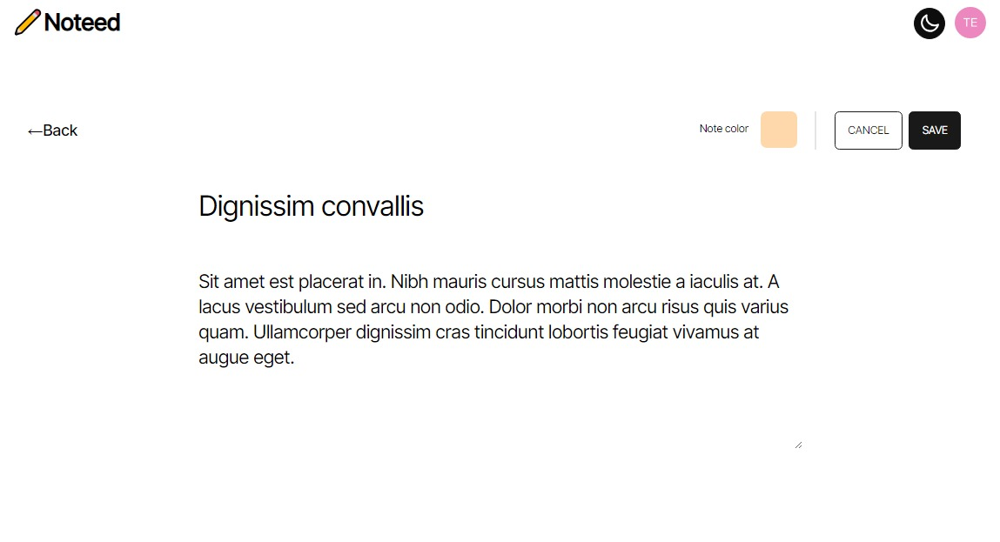
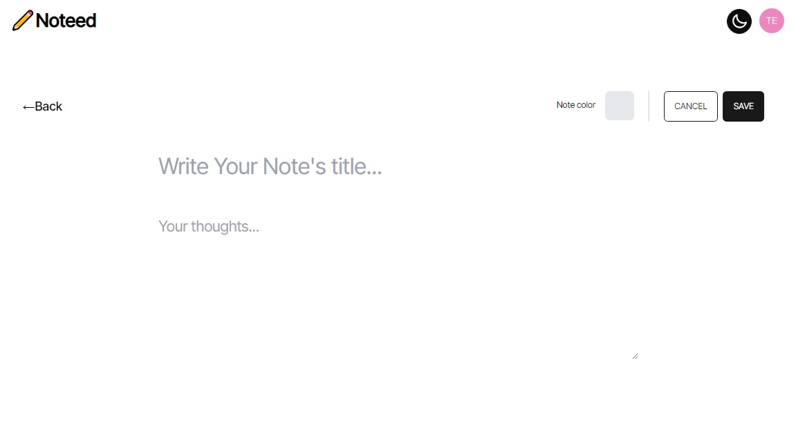
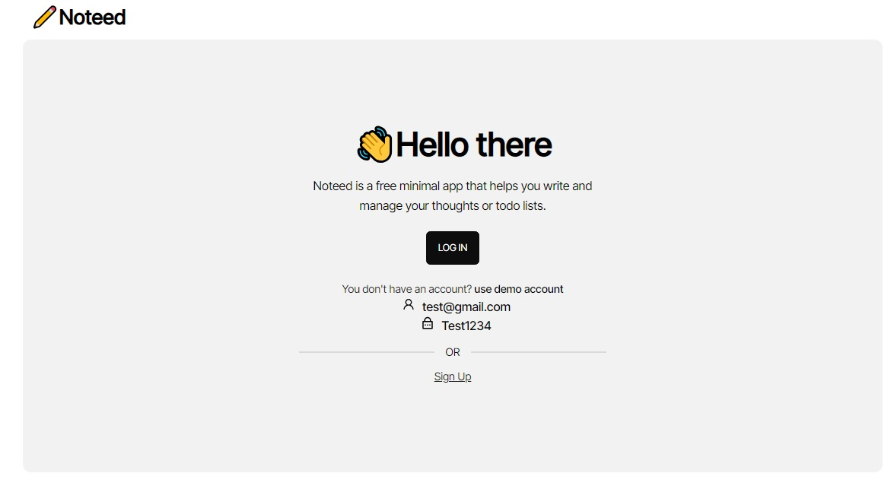

# Noteed

Noteed is a free minimal app that helps you write and manage your thoughts or todo lists, with the ability to access your notes from different devices.

I've used Vercel for the deployment. Give it a try: https://noteed-lime.vercel.app/

## Tech Stack

- Front-end: React, React Query, React Router, Tailwind CSS (Daisy UI).
- Back-end: Xano to store notes, and generate RESTful APIs.
- Authentication: Auth0.

## Screenshots






## Run Locally

Clone the project

```bash
  git clone https://link-to-project
```

Go to the project directory

```bash
  cd my-project
```

Install dependencies

```bash
  npm install
```

Start the server

```bash
  npm start
```
